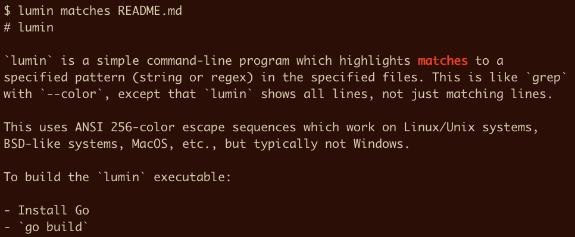
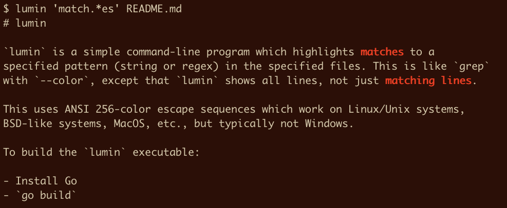
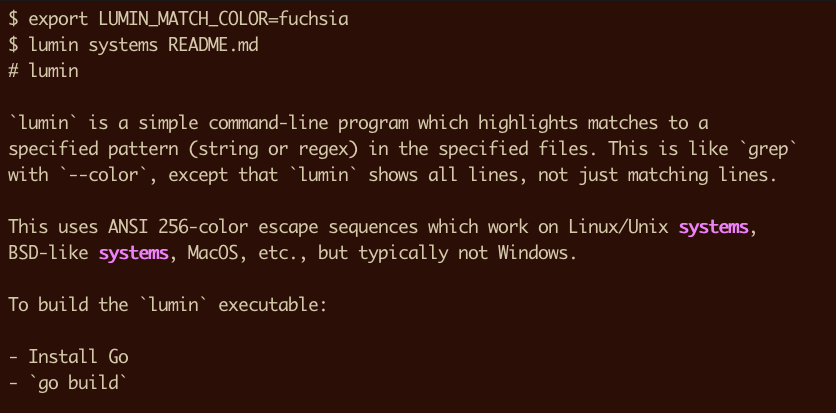
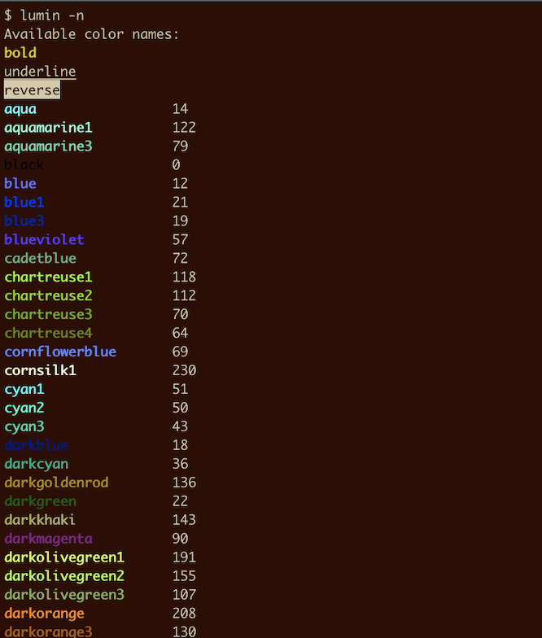
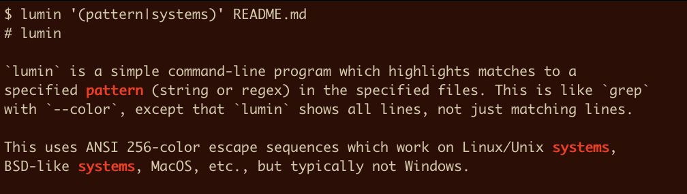
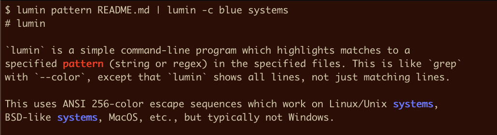
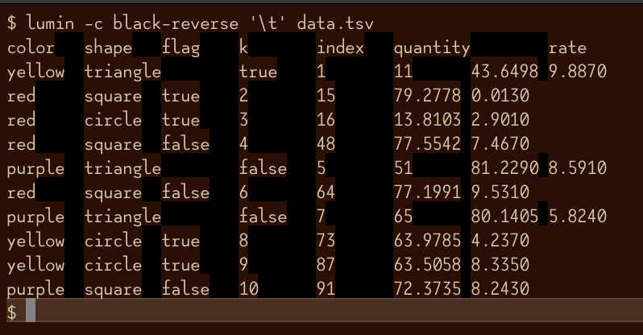
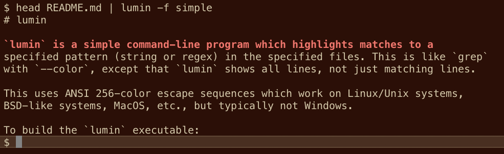

# lumin

## What lumin does

`lumin` is a simple command-line program which highlights matches to a
specified pattern (string or regex) in the specified files. This is like `grep`
with `--color`, except that `lumin` shows all lines, not just matching lines.

This uses ANSI 256-color escape sequences which work on Linux/Unix systems,
BSD-like systems, MacOS, etc., but typically not Windows.

Matching a string:



Matching a regular expression:



Color choices:





Multi-pattern matching:



Multi-color matching:



Matching on blankspace:



Highlighting full lines on a match:



Note:

Many programs (`git diff`, `grep` with `--color`, etc. etc.) colorize their output when they detect that standard output is a terminal, and non-colorize when standard output is a file or a pipe. By contrast, `lumin` always colorizes, since colorization is its one and only job. This is what makes `lumin -c red foo myfile.txt | lumin -c blue bar` work.

## On-line help

`lumin --help`

```
Usage: lumin [options] {pattern} [zero or more filenames]
Highlights matches to {pattern} in the specified files.
If zero filenames are specified, standard input is read.
This is like grep with --color, except it shows all lines, not just
matching lines.

Options:
-w                     Restrict matches to word boundaries.
-i                     Allow for case-insensitive matches.
-f|--full-lines        Highlight entire lines on a match. Incompatible with -w.
-c|--color {name}      Use {name} to highlight matches -- see -l/-n for choices.
                       Example names: red, yellow, green, orchid, 9, 11, 2, 170.
                       You can also use bold, underline, and reverse. As well,
                       combinations of these joined with a -, such as bold-red,
                       bold-underline, red-underline, etc.
                       You can also set the LUMIN_MATCH_COLOR environment variable if you like.
-l|--list-color-codes  Show available color codes 0..255.
-n|--list-color-names  Show available color names (aliases for the 0..255 codes)
                       along with bold, underline, reverse, and combinations.
--                     Signify end of options, so next argument is the pattern.
                       E.g. to search for "-x" in file foo.txt, use "lumin -- -x foo.txt".
-h|--help              Print this message.
```

## Building from source

- First:
  - `cd /where/you/want/to/put/the/source`
  - `git clone https://github.com/johnkerl/lumin`
  - `cd lumin`
  - Install Go if you have not already
- Without `make`:
  - Type `go build`
  - To install: `go install github.com/johnkerl/miller/v6/cmd/lumin@latest` will install to
    _GOPATH_`/bin/lumin`.
- With `make`:
  - To build: `make`. This takes just a few seconds and produces the lumin executable, which is
    `./lumin` (or `.\lumin.exe` on Windows).
  - To install: `make install`. This installs the executable `/usr/local/bin/lumin` and manual page
    `/usr/local/share/man/man1/mlr.1` (so you can do `man mlr`).
  - You can do `./configure --prefix=/some/install/path` before `make install` if you want to
    install somewhere other than `/usr/local`.
