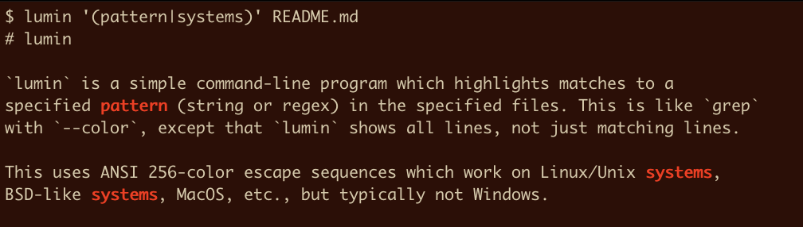

# lumin

`lumin` is a simple command-line program which highlights matches to a
specified pattern (string or regex) in the specified files. This is like `grep`
with `--color`, except that `lumin` shows all lines, not just matching lines.

This uses ANSI 256-color escape sequences which work on Linux/Unix systems,
BSD-like systems, MacOS, etc., but typically not Windows.

To build the `lumin` executable:

- Install Go
- `go build`

Matching a string:


Matching a regular expression:


Color choices:


Multi-pattern matching:



Multi-color matching:


Note:

Many programs (`git diff`, `grep` with `--color`, etc. etc.) colorize their output when they detect that standard output is a terminal, and non-colorize when standard output is a file or a pipe. By contrast, `lumin` always colorizes, since colorization is its one and only job. This is what makes `lumin -c red foo myfile.txt | lumin -c blue bar` work.

On-line help:

```
Usage: lumin [options] {pattern} [zero or more filenames]
Highlights matches to {pattern} in the specified files.
If zero filenames are specified, standard input is read.
This is like grep with --color, except it shows all lines, not just
matching lines.

Options:
-w                     Restrict matches to word boundaries.
-i                     Allow for case-insensitive matches.
-c|--color {name}      Use {name} to highlight matches -- see -l/-n for choices.
                       Example names: red, yellow, green, orchid, 9, 11, 2, 170.
                       You can also set the LUMIN_MATCH_COLOR environment variable if you like.
-l|--list-color-codes  Show available color codes 0..255.
-n|--list-color-names  Show available color names (aliases for the 0..255 codes).
-h|--help              Print this messsage.
```
